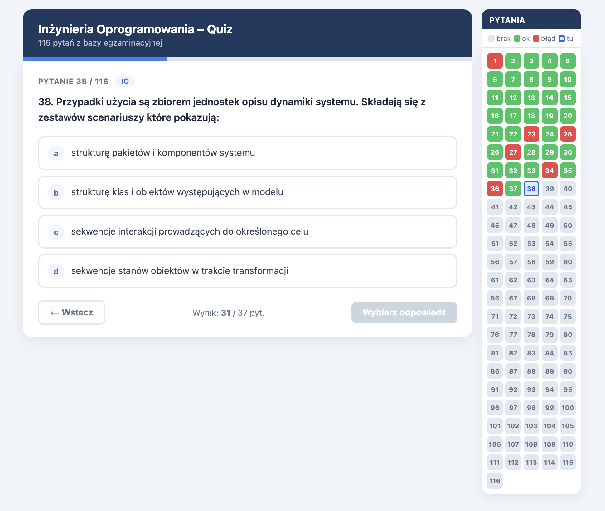

# Quiz – Inżynieria Oprogramowania

Interaktywny quiz do nauki na egzamin z Inżynierii Oprogramowania. 116 pytań zamkniętych w formie testu jednokrotnego wyboru.

## Uruchomienie

Otwórz plik `quiz_IO.html` w przeglądarce — nie wymaga serwera ani instalacji.

## Funkcje

- **116 pytań** z zakresu IO (UML, modele cyklu życia, testowanie, architektura, OOP i inne)
- **Losowa kolejność pytań** przy każdym uruchomieniu (bez powtórzeń)
- **Nawigacja** — przycisk Wstecz oraz boczny panel z kafelkami do skakania między pytaniami
- **Natychmiastowy feedback** po wyborze odpowiedzi (poprawna/błędna)
- **Podsumowanie wyników** z oceną po zakończeniu quizu
- **Tryb przeglądu** — po zakończeniu można przejrzeć wszystkie pytania z zaznaczonymi odpowiedziami

## Skala ocen

| Ocena | Próg |
|-------|------|
| 5.0   | ≥ 95% |
| 4.5   | ≥ 90% |
| 4.0   | ≥ 85% |
| 3.5   | ≥ 80% |
| 3.0   | ≥ 75% |
| ndst  | < 75% |